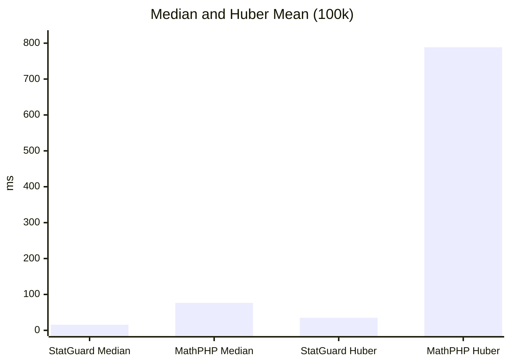

# Benchmarks
[English](../README.md) | [Español]

## Metodologia

- Dataset: 100,000 floats pseudoaleatorios (seed fija).
- Entorno: ejecucion local con PHP 8.x y el script `tests/BenchmarkStatGuard.php`.
- Comparativas: StatGuard vs MathPHP (cuando existe equivalente) y paridad numerica con R.
- R usa `system.time()` y solo mide computo (se excluye la carga del CSV).

Para generar y actualizar la tabla en Markdown:

```bash
php tests/BenchmarkStatGuard.php report
```

## Paridad Cientifica (vs R)

StatGuard replica los 9 tipos de cuantiles de R y contrasta sus resultados con el motor base de R. Los valores de referencia en la tabla permiten comparar salida numerica y tiempos.
La columna Status marca ✅ cuando la diferencia absoluta entre StatGuard y R es menor a 0.0001.

<!-- BENCHMARK_PARITY_START -->
| Method | StatGuard ms | StatGuard value | MathPHP ms | MathPHP value | R ms | R value | Status |
| :--- | ---: | ---: | ---: | ---: | ---: | ---: | :---: |
| Median | - | - | - | - | - | - | ❌ |
| Quantile Type 1 (p=0.75) | - | - | - | - | - | - | ❌ |
| Quantile Type 2 (p=0.75) | - | - | - | - | - | - | ❌ |
| Quantile Type 3 (p=0.75) | - | - | - | - | - | - | ❌ |
| Quantile Type 4 (p=0.75) | - | - | - | - | - | - | ❌ |
| Quantile Type 5 (p=0.75) | - | - | - | - | - | - | ❌ |
| Quantile Type 6 (p=0.75) | - | - | - | - | - | - | ❌ |
| Quantile Type 7 (p=0.75) | - | - | - | - | - | - | ❌ |
| Quantile Type 8 (p=0.75) | - | - | - | - | - | - | ❌ |
| Quantile Type 9 (p=0.75) | - | - | - | - | - | - | ❌ |
| Huber mean | - | - | - | - | - | - | ❌ |
<!-- BENCHMARK_PARITY_END -->

!!! info
	La tabla se actualiza automaticamente con `php tests/BenchmarkStatGuard.php report`.

## Rendimiento (vs MathPHP)

StatGuard mantiene competitividad en operaciones clasicas y supera a MathPHP en estadistica robusta. Los benchmarks mas representativos muestran una ventaja clara en mediana y Huber.



## Conclusiones

StatGuard es la unica libreria PHP que garantiza paridad con los 9 tipos de cuantiles de R y entrega un rendimiento superior a MathPHP en operaciones criticas de estadistica robusta.

Built with ❤️ by cjuol.
