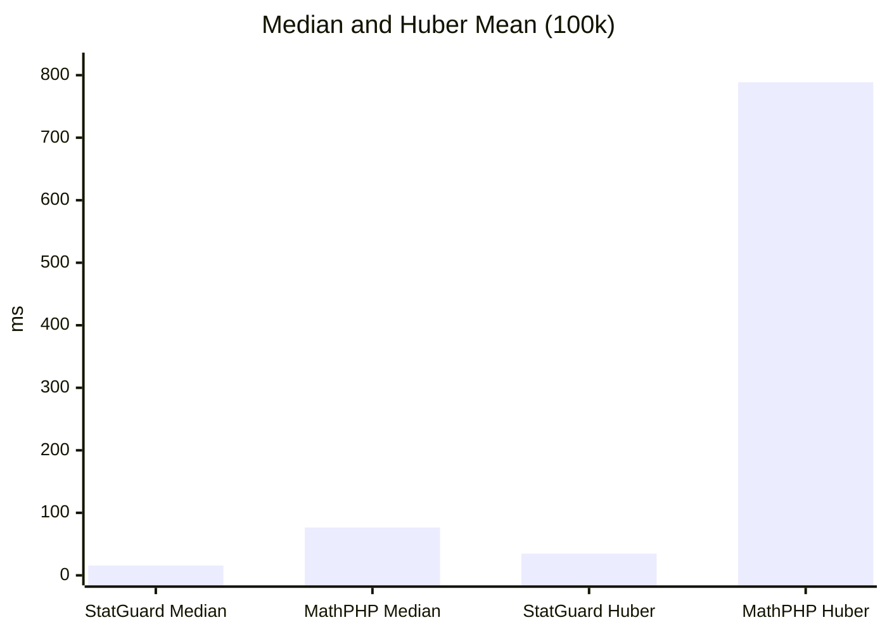

# Benchmarks

## Methodology

- Dataset: 100,000 pseudo-random floats (fixed seed).
- Environment: local execution with PHP 8.x and `tests/BenchmarkStatGuard.php`.
- Comparisons: StatGuard vs MathPHP (when an equivalent exists) and numeric parity with R.
- R uses `system.time()` and only measures computation (CSV load excluded).

To generate and update the Markdown table:

```bash
php tests/BenchmarkStatGuard.php report
```

## Scientific parity (vs R)

StatGuard replicates the 9 R quantile types and compares results against R. The reference values in the table allow comparing numeric output and timing.
The Status column shows ✅ when the absolute difference between StatGuard and R is smaller than 0.0001.

<!-- BENCHMARK_PARITY_START -->

| Method | StatGuard ms | StatGuard value | MathPHP ms | MathPHP value | R ms | R value | Status |
| :--- | ---: | ---: | ---: | ---: | ---: | ---: | :---: |
| Median | 15.23 | 499.249 | 71.69 | 499.249 | 1.00 | 499.249 | ✅ |
| Quantile Type 1 (p=0.75) | 14.79 | 747.736 | 14.69 | 747.7385 | 1.00 | 747.736 | ✅ |
| Quantile Type 2 (p=0.75) | 14.36 | 747.741 | 15.37 | 747.7385 | 1.00 | 747.741 | ✅ |
| Quantile Type 3 (p=0.75) | 14.81 | 747.736 | 15.99 | 747.7385 | 2.00 | 747.736 | ✅ |
| Quantile Type 4 (p=0.75) | 14.75 | 747.736 | 15.02 | 747.7385 | 1.00 | 747.736 | ✅ |
| Quantile Type 5 (p=0.75) | 13.99 | 747.741 | 14.72 | 747.7385 | 1.00 | 747.741 | ✅ |
| Quantile Type 6 (p=0.75) | 13.67 | 747.7435 | 14.42 | 747.7385 | 1.00 | 747.7435 | ✅ |
| Quantile Type 7 (p=0.75) | 14.03 | 747.7385 | 15.12 | 747.7385 | 1.00 | 747.7385 | ✅ |
| Quantile Type 8 (p=0.75) | 13.75 | 747.741833 | 15.03 | 747.7385 | 2.00 | 747.7418 | ✅ |
| Quantile Type 9 (p=0.75) | 14.10 | 747.741625 | 15.15 | 747.7385 | 2.00 | 747.7416 | ✅ |
| Huber mean | 33.00 | 499.174389 | 37.83 | 499.243589 | 8.00 | 499.18 | ❌ |

<!-- BENCHMARK_PARITY_END -->

!!! info
	The table is updated automatically with `php tests/BenchmarkStatGuard.php report`.

## Performance (vs MathPHP)

StatGuard stays competitive on classic operations and outperforms MathPHP in robust statistics. The most representative benchmarks show a clear advantage in median and Huber.



## Conclusions

StatGuard is the only PHP library that guarantees parity with the 9 R quantile types and delivers better performance than MathPHP in critical robust statistics operations.

Built with ❤️ by cjuol.
